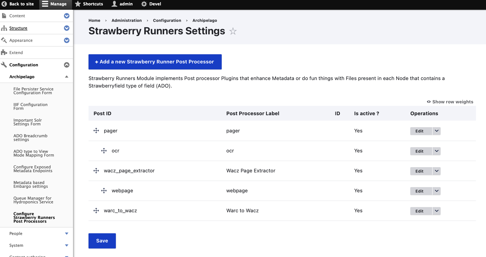

# Strawberry Runners Post-Processing Configuration

Archipelago's [Strawberry Runners (SBR)](https://github.com/esmero/strawberry_runners) module provides provides a set of post-processing capabilities for the JSON based metadata, files and entities that comprise your Archipelago Digital Objects (ADOs). These post-processing actions are based on dispatched events, direct http calls, and invoked webhooks from partner services (such as Min.io, AWS S3 or self-invoked). 

The default Archipelago SBR post-processor configurations include operations that:
- perform page-based HOCR/OCR for image and pdf-based ADOs, send the output to the Search API, and use Natural Language Processing to extract entities from the output
- extract text from pages within a Webarchives File and send the output to the Search API
- convert WARC format Webarchives Files into WACZ format and attach the new WACZ file to the original source ADO to complement the WARC original 

SBR actions can be chained and nested to enable ordered operations, such as first extract individual pages in an ordered sequence and then run HOCR/OCR across the individual pages.

## Strawberry Runners Settings Overview

You can access the Strawberry Runners Settings:

- Through the `Manage` menu > `Configuration` > `Archipelago` > `Configure Strawberry Runners Post Processors`
- Directly at `/admin/config/archipelago/strawberry_runners` 

On the Strawberry Runners Settings page, you will see the Archipelago default post processor configurations (unless modified).

1. The `pager` action uses the 'Post processor that extracts/generates Ordered Sequences of files/pages/children using Files present in an ADO' plugin.
2. Nested one level in, the `ocr` action uses the 'Post processor that Runs OCR/HORC against files' plugin. The `ocr` operations will be executed after the completion of the `pager` operations.
3. The `wacz_page_extractor` action uses the 'Post processor that extracts/generates Indexed Page Content from WACZ files in an ADO' plugin.
4. Nested one level in, the `webpage` action uses the 'Post processor that Indexes WACZ Frictionless data Search Index to Search API' plugin. The `webpage` operations will be executed after the completion of the `wacz_page_extractor` operations.
5. The `warc_to_wacz` action uses the 'Post processor that uses a System Binary to process * files' operations.

## Reviewing and Adjusting the default Post-Processors

From the main Strawberry Runner Settings page, you can review and adjust the settings for the default Archipelago configurations by selecting `Edit` from the `Operations`` menu. 

Please see the following guides for:

- [Adjusting the `pager` and `ocr` operations](strawberryrunners_pager_ocr.md)
- [Adjusting the `wacz_page_extractor` and `webpage` operations](strawberryrunners_webpage_text.md)
- [Adjusting the `warc_to_wacz` operation](strawberryrunners_wacz_binary.md)

## Triggering Post-Processing Actions Manually

After making adjustments to Strawberry Runners Post-Processing configurations, you may want to trigger/re-trigger a particular action manually.

You can use Archipelago's [Find and Replace](find_and_replace.md) to first select a specific group of Digital Objects you wish to target for Post-Processing, then select the `Trigger Strawberrry Runners process/reprocess for Archipelago Digital Objects content item` from the [Find and Replace](find_and_replace.md) `Actions menu`.

### Additional Post Processor Operations

Archipelago also includes the `Post processor that writes/reads Frictionless Data Packages` plugin. Please keep a lookout for future documentation related to using this plugin.

